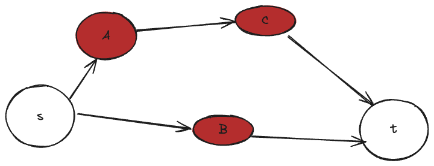

# Many reduction
Here is the reduction *Longest path* $<_p$ *Many*.
**Claim**: Many is NP-hard

**Proof**: We will reduce from longest path which is known to be NP-hard

Let G be an instance of longest path.
G has with vertex set $V(G)$ and edge set $E(G)$.
G has no cycles.
The desired output is *yes* if G contains a path of k or more edges, and no otherwise

Construct an instance of $G$ of Many that consist only of red vertices. ie.
$V(G) \in R$.

For instance if we have the following graph:

Then the resulting path for *many* is going to return is the path p: `s -> A -> C -> t` 
Now assume that $p \subset G$ is a solution to the *Many* instance. In other words p in G contains all of p' in  $G'$.
Then the corresponding path in G is a longest path of G.

<!--Conversely, if $C \subset V$-->

